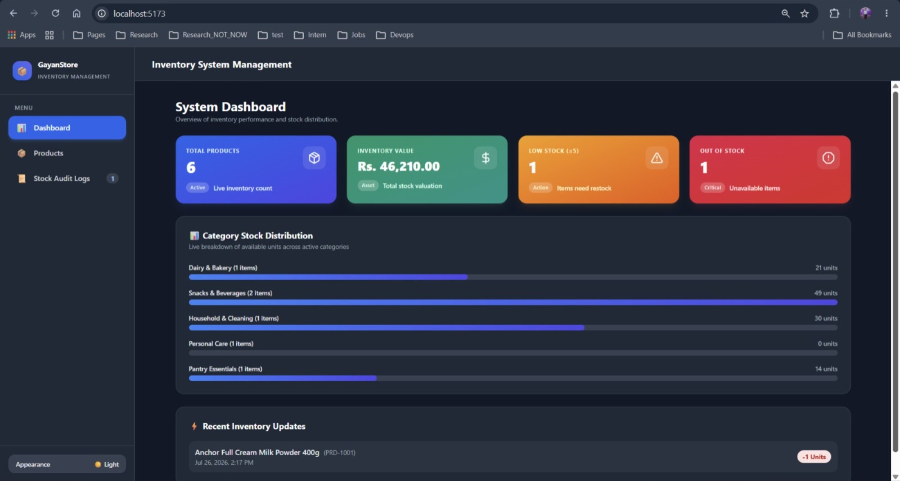
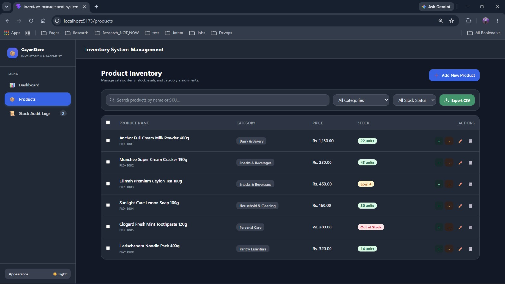
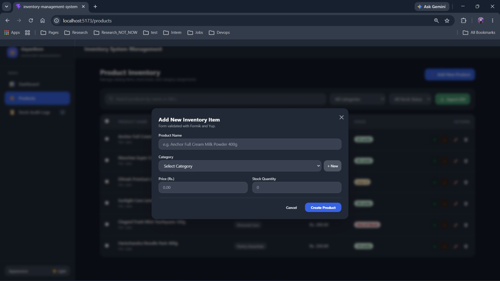
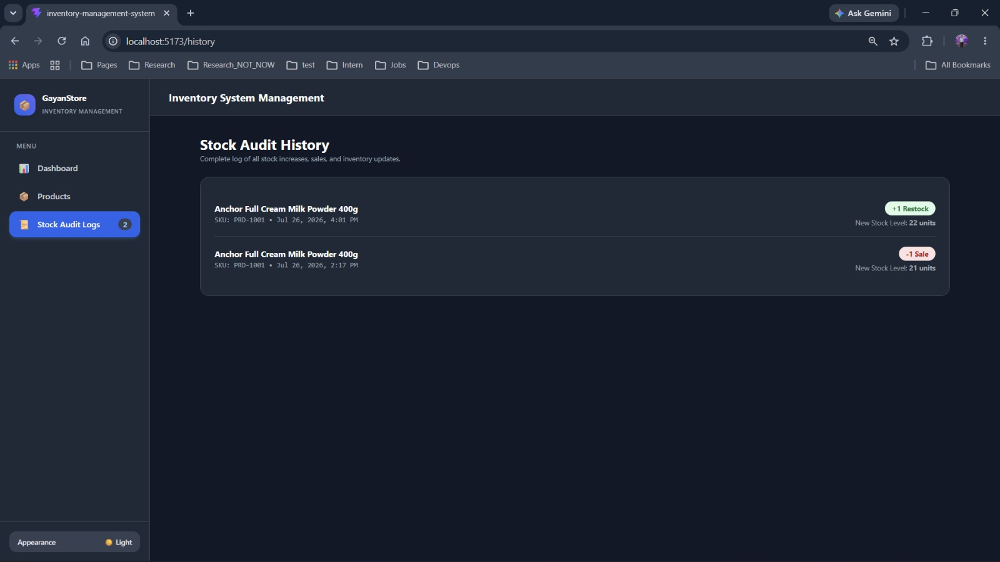

# GayanStore — Inventory Management System

GayanStore is a modern, lightweight, client-side Inventory Management Application built to streamline stock tracking, product management, and inventory analytics for retail businesses. 

Designed as a single-page application (SPA), it operates seamlessly without requiring a backend database by leveraging HTML5 `localStorage` for complete data persistence.

---

## Key Features Implemented

### 1. Product Management
- **Add & Edit Products**: Full CRUD operations for managing product details.
- **Auto-Generated SKU**: Automatically generates unique product IDs (e.g., `PRD-482910`).
- **Form Validation**: Powered by **Formik + Yup** for strict type checking, non-negative quantity limits, and helpful inline error messages.

### 2. Stock Management & Real-time Auditing
- **Quick Restock & Sales**: Instant single-click buttons to increase or decrease stock levels.
- **Stock History Logs**: Every stock adjustment is recorded with a precise date and timestamp for complete audit trails.
- **Out of Stock Prevention**: Built-in guardrails to prevent stock levels from dropping below zero.

### 3. Interactive Dashboard & Analytics
- **Live Inventory Metrics**: Overview of Total Products, Total Inventory Valuation (LKR), Low Stock warnings (≤ 5 units), and Out of Stock alerts.
- **Category Stock Distribution**: Visual progress-bar analytics chart showcasing stock breakdown per category.

### 4. Category Management & Custom Categories
- Organized category structures with real-time item counts.
- Flexibility to add **Custom Categories** directly from the product form.

### 5. Multi-Criteria Search & Filtering
- **Keyword Search**: Instant search by Product Name or SKU code.
- **Category Filter**: Filter product listings by specific categories.
- **Stock Status Filter**: Quick toggles to view `In Stock` vs `Out of Stock` items.

### 6. Bonus Features Added
- **Bulk Actions**: Select multiple items simultaneously for batch deletion or bulk restocking (+10 units).
- **Export to CSV**: One-click download of the entire inventory database into `.csv` format for reporting.
- **Dark Mode Support**: Full light/dark mode UI adaptiveness.

---

## Tech Stack

- **Framework**: React.js (Vite)
- **Form Handling & Validation**: Formik + Yup
- **Styling**: Tailwind CSS
- **Iconography**: Lucide React
- **Notifications**: React Hot Toast
- **Data Persistence**: HTML5 `localStorage`

---

## How to Run Locally

Follow these steps to set up and run the project on your local machine:

### Prerequisites
Make sure you have **Node.js** (v16 or higher) and **npm** installed.

### 1. Clone the Repository
```bash
git clone [https://github.com/your-username/inventory-management-system.git](https://github.com/your-username/inventory-management-system.git)
cd inventory-management-system
```
### 2. Install Dependencies
```bash
npm install
```
### 3. Start the Development Server
```bash
npm run dev
```

## The application will be running at http://localhost:5173.
## Deployment Link - https://inventory-management-system-omega-ruddy.vercel.app


## Application Screenshots

### 1. Dashboard & Analytics View


### 2. Product Management & Data Table


###  3. Product Adding


###  4. Stock Audit History Logs



